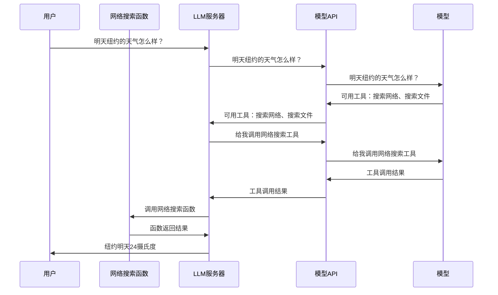

# 它是什么？

Function Calling 是大模型的核心能力，指模型根据用户需求自动决策是否需要调用外部工具（如 API、数据库、计算器等），识别提取调用外部工具所需参数，与其他系统配合执行工具并获取结果后整合生成最终答案的能力。

一个典型的Function Calling工作流程可以简化为以下几步：

1. 用户提问：用户向应用程序提出自然语言请求。
2. 模型解析与决策：应用程序将用户请求和预定义的函数描述列表发送给模型。模型分析后，若需调用函数，则生成结构化调用指令（如JSON）。
3. 外部执行：应用程序解析模型返回的指令，在外部安全地执行相应的函数或API调用。
4. 结果整合：应用程序将函数执行的结果返回给模型，模型据此生成最终的自然语言回复给用户。

# 为什么要用它？

明天天气怎么样？ -- 大模型无法回答

大模型一旦训练出来，其学习到的知识将固化为模型参数权重，不再更新了。在模型发布时会告知模型知识的截止时间。比如2025年8月发布的DeepSeek-V3.1版本，其知识截止时间为2024年7月。

# 如何让模型具备这种能力？

Function Calling（函数调用）并非大模型完全独立、原生具备的能力，而是大模型在特定训练基础上，与外部系统协同合作的一种机制。需要经过训练，如指令微调、RLHF。让模型拥有以下能力：理解“要做什么”、判断“用什么工具”（工具列表及工具能力）、知道“告诉工具怎么去做”（结构化json+准确参数调工具）

# 模型调用链路分析

MCP部分：网络搜索函数与LLM服务器之间。

FunctionCalling部分：LLM服务器与模型API之间。

# 与MCP对比

MCP 和 Function Calling（函数调用）都是用于增强LLM能力的机制，但有所不同：

| 特性         | MCP                              | Function Calling                   |
| ------------ | -------------------------------- | ---------------------------------- |
| 性质         | 开放标准协议                     | 模型专有功能                       |
| 范围         | 通用（多数据源、多功能）         | 特定场景（单一功能）               |
| 开发复杂度   | 低（统一协议，一次开发多端通用） | 高（需为每个任务开发）             |
| 跨模型兼容性 | 支持多模型（如Claude、GPT等）    | 通常仅限特定模型（如OpenAI的模型） |
| 灵活性       | 高，支持动态发现和扩展工具       | 相对较低，功能集通常固定           |

两者并不互斥，可以结合使用。例如，一个支持 MCP 的 AI 代理可以同时支持 Function Calling 以增强工具调用能力。虽然任何模型理论上都能通过上述方式与 MCP 交互，但模型的原生能力确实会影响使用 MCP 的体验和效果：

| 模型能力                                      | 使用 MCP 的体验                                              |
| --------------------------------------------- | ------------------------------------------------------------ |
| 支持 Function Calling                         | 体验最佳。工具调用准确率高，能更好地理解复杂参数和用户意图，与 MCP 集成流畅。 |
| 不支持 Function Calling，但结构化输出能力较强 | 体验中等。通过精心设计的提示词，可以较好地利用 MCP，但可能需要更多调试，且在复杂场景下稳定性可能不足。 |
| 结构化输出能力很弱                            | 体验较差。很难通过提示词约束其输出格式，可能导致 MCP 客户端无法正确解析，调用失败率高。 |

# 进阶A2A

agent to agent 协议，解决“多个智能体如何协作完成任务”。
