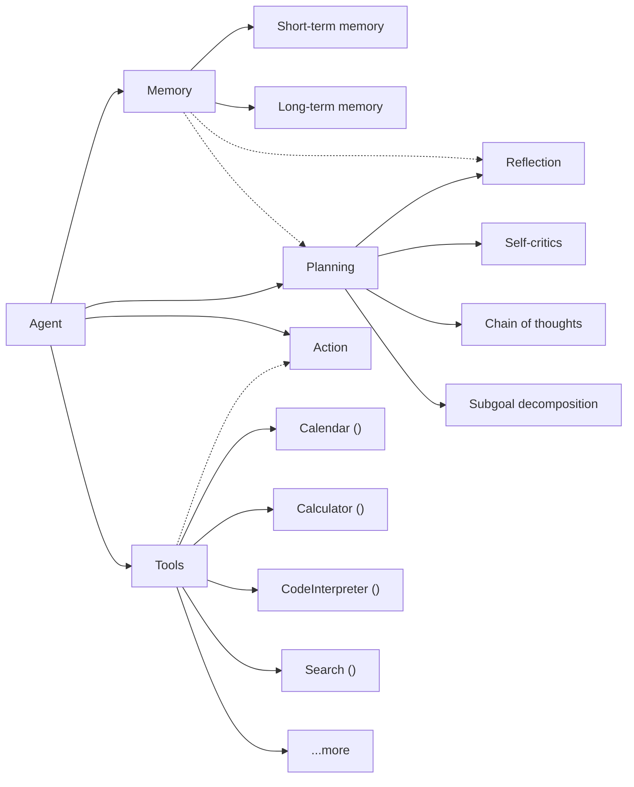
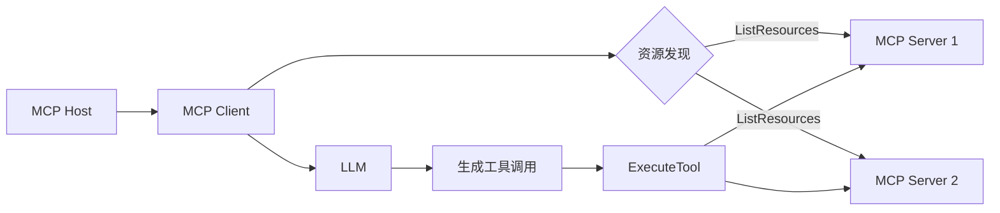
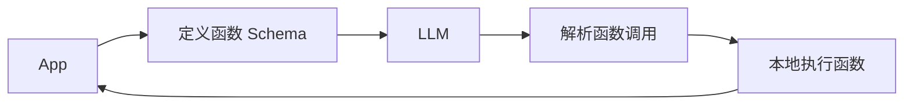
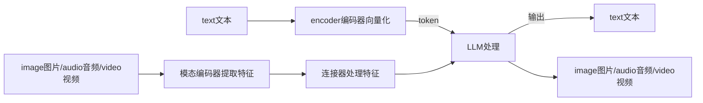

# agent原理

## agent技术在LLM应用范式的分级

| LLM应用范式分级 | 人工参与程度                                         | AI参与程度                               | 示例                       |
| --------------- | ---------------------------------------------------- | ---------------------------------------- | -------------------------- |
| L1 无LLM        | 95%                                                  | 5% 非LLM的传统AI辅助参与                 |                            |
| L2 ChatBot      | 80%~90% 提问                                         | 10%~20% 根据提问给出信息                 | ChatGPT/AskAl/GenieAl      |
| L3 Copilot      | 50% 给出Prompt/修改Prompt                            | 50% 根据Prompt给出初稿并优化             | GitHub/Copilot/MidJourney  |
| L4 Agent        | 20% 给出初始目标，监督过程、评估结果，提供接口等资源 | 80% 自主完成任务分解，选择工具，自我迭代 | HuggingGPT/AutoGPT/BabyGPT |
| L5 AGI          | 给出目标                                             | 根据目标自主完成所有工作                 | 冯诺依曼机器人             |

##　agent技术的发展

##　AI Agent定义

- 百度的定义 以大语言模型为大脑驱动的系统，具备自主理解、感知、规划、记忆和使用工具的能力，能够自动化执行完 成复杂任务的系统 

- 学术界的定义 Agent需要拥有记忆、工具、计划能力、执行能力等，主要用于自主完成任务，定义较为广泛。 

- OpenAl的定义 不直接称呼Agent概念，在OpenAl 2023/11发布会上发布Assistant，定义为具备知识库与工具的个人助理，但 实现逻辑本质也是Agent。

智能体 = 环境感知 + LLMs + 规划 + 记忆 + 工具，即人类的 五感接收信息+大脑思考+四肢执行。

应用：场景化封装智能体

能力下限：可调用工具的多少，即有多少agent API。

能力上限：MML能力，即思考+规划。

## Agent核心能力

- 环境感知能力：

文本处理能力（分析/对话）

图片（文字/颜色/布局）chatgpt 4 vision多模态

语音（语调/语气/语速等处理）chatgpt 4 o

视频处理能力（故事情节/前因后果）

- 自主规划能力：

阶段一、COT思维链/TOT思维树

阶段二、workflow（pipline提前规划流程，可依托Coze、dify、fastgpt等进行平台 进行pipleline构建）+多智能体（分项处理，Langchain、RAGflow等框架集成支持）

阶段三、thinking模型（deepseek R1深度思考）

阶段四、ALL in LM（google gemini的deepReaserch端到端多模态）

- 工具调用能力

阶段一、Function Call（工具开发API，agent调用API）根据工具指定的接口开发，要提前适配工具

阶段二、模型学习人使用电脑（学习使用电脑屏幕 → 学习使用浏览器→分析拆解指令，逐步执行思考）manus

阶段三、接口标准化（MCP，模型上下文协议）根据标准接口开发，可自动检索API市场，自动调用，C/S模式

MCP 工作流示例

Function Calling 工作流示例

长远看MCP和FunctionCall会共存，模型资源壁垒，性能问题

- 记忆能力

短期记忆：当前对话上下文

长期记忆：历史对话结果，对于模型能力有要求，能处理的token数量

## Agent落地流程

一个agent应用的使用流程：

结果评估占用1/3-1/4时间。

##　Agent应用范式

- 知识检索。如RAG检索增强生成，将知识库和问题通过embedding模型检索生成提示内容，再交给LLM总结生成回答。
- 工具调用。买机票/电影票等，通过MCP/Function Call将工具注册到LLM，通过LLM思考调用。
- NL2SQL。使用自然语言进行数据库查询检索。
- Code Interpreter。代码解释器。

Code Interpreter可以对文件进行处理，通过代码运行，降低了幻觉和迷感的概率。 

Code Interpreter让 Al 的用途更加广泛，用户不必过多"编程”。

## Agent派别

通用派：Manus/GPT-5 全能

垂直派：医疗/法律/金融等，单一领域

## Agent应用

### 通用智能体

政府公文：RAG+历史公文，

政府办事大厅：语音识别+RAG，精准定位诉求，如办出生证明

### 专业智能体

中医药知识问答/病理符合度判断

# 提示词工程

## 定义

prompt engineering：常规prompt是指app输入的界面词；这里的工程指通过API接口给LLM发出指令

token：自然语言里最小单元是汉字/单词；LLM里最小单元是token，不同模型使用不同分词器将单词分割为token。

hidden prompt：app会对用户的prompt进行一层封装，添加一些隐形提示词，达到补全/限制等作用。

prompt工程参数：

Temperature：[0-1]用于控制返回结果的确定性，越小越确定。

Top_p：用于控制返回结果的真实性，越小越真实。

max_length：控制生成的token数。

Stop Sequence：控制生成列表的项数。控制响应长度和结构。

Frequency Penalty：频率惩罚，通过token曾出现的频率来控制下一个token出现的概率，值越大惩罚越高。

Presence Penalty：存在惩罚，控制token是否出现过来控制下一个token出现的概率，值越大惩罚越高。

## 模型分类

一、

推理大模型：明确任务目标和需求即可。

非推理大模型：通用模型。显示引导推理步骤。依赖提示词

二、CoT思维链

概率预测。快速反应

链式推理。慢速思考

## 提示词架构

选择/设计适合自己/项目使用的架构，以下是一些架构举例：

RTGO

role/task/goal/objective操作要求、宗旨

COSTAR

context上下文背景/obective目标/style风格/tone语调/audience受众/response响应形式

## 提示词类型

指令型提示词：直接告诉AI需要执行的任务。 

问答型提示词：向AI提出问题，期望得到相应的答案。 

角色扮演型提示词：要求AI扮演特定角色，模拟特定场景。 

创意型提示词：引导AI进行创意写作或内容生成。 

分析型提示词：要求AI对给定信息进行分析和推理。

多模态提示词：结合文本、图像等多种形式的输入。

## 基于智能体开发平台的Prompt实操

智能体开发平台：AI技术普惠化的工具，帮助开发者/企业构建智能化服务。如coze/dify

### 课题 

用户对话，从对话中获取用户信息，确认用户权限，回答用户问题。

### 开发思路

分析核心诉求：1.从对话中获取用户信息；2.获取到信息后进行知识问答。本质是基于RAG解决方法的知识问答。

分析实施路径：1.设计RAG；2.让LLM提取用户信息。用到文本内容提取功能；3.设计逻辑。通过判断将上述步骤串联起来。

### 实操步骤

1. 创建知识库。选取索引模型/文本理解模型，导入知识，平台根据模型对知识进行拆分/向量化。
2. 创建流程编排。标准RAG流程，根据问题检索知识库，生成prompt交给LLM回答。
3. 加入定制化流程。LLM采集用户信息。
4. 加入定制化流程。用户信息不完善，LLM继续追问。
5. 加入定制化流程。采集完毕，更新标志位，进入问答。
6. 进入问答，判断标志位，标志位不在进入步骤3，存在进入步骤2。

# 多模态大模型

## 基本概念

大模型：

广义——参数量大、结构复杂的深度学习模型。也叫基础模型（FM, Foundation Model），基于广泛的训练数据，通常自监督学习，通过提示/微调广泛适应下游任务。

狭义——参数规模在一百亿10B以上，使用大规模的训练数据，具有良好的涌现能力，并在各种任务上达到较高性能水平的模型。

对比传统模型：具有涌现能力（规模提升性能突增）、参数规模庞大、多任务通用性。

## 大模型分类

| 分类方式     | 类别                                      | 适用任务                                                     |
| ------------ | ----------------------------------------- | ------------------------------------------------------------ |
| **输入类型** | NLP（自然语言处理）大模型                 | 文本生成、翻译、问答等语言任务，训练数据以文本为主，应用场景覆盖智能客服、内容创作、法律文书生成等典型架构包括： 1. 生成式模型：如GPT-4（文本生成）、PaLM（多语言处理）； 2. 理解式模型：如BERT（语义分析）、T5（文本分类） |
|              | CV（计算机视觉）大模型                    | 图像/视频处理任务，应用领域涵盖自动驾驶、安防监控、医学影像分析等。典型能力包括： 1. 图像分类与检测：如Vision Transformer（ViT）、YOLO系列； 2. 图像生成与编辑：如Stable Diffusion、DALL·E； 3. 视频理解：如Sora（视频生成）、SlowFast（动作识别） |
|              | 多模态大模型                              | 支持跨数据类型（文本、图像、音频等）的联合处理与生成，应用场景包括虚拟现实、智能机器人、跨媒体内容创作，关键技术包括： 1. 跨模态对齐：如CLIP（图文匹配）、Flamingo（多模态对话）； 2. 多模态生成：如Sora（视频生成）、DALL·E 3（文生图） |
| **应用领域** | L0 通用大模型                             | 跨领域多任务基座模型，通过海量通用数据预训练，具备基础认知与泛化能力（如文本生成、图像理解），代表技术如GPT、CLIP。类比“通识教育阶段” |
|              | L1 行业大模型                             | 聚焦特定领域（如医疗、金融），基于行业知识库和场景数据定向优化，实现专业化能力跃迁（如医疗问诊、工业质检）。类比“专业学科深造” |
|              | L2 场景大模型                             | 针对细分任务（如法律文书生成、生产线故障诊断），通过高精度场景数据微调，达到端到端任务最优解。类比“科研攻坚阶段” |
| **模型架构** | 密集模型（Dense Models）                  | 基于Transformer的完全参数激活模式，全连接参数结构，如GPT系列、LLaMA等 |
|              | 稀疏模型（Sparse Models）                 | 通过动态激活部分参数提升效率，通过路由机制选择特定子网络处理输入，实现参数规模与计算效率的平衡。如混合专家模型（MoE），如（DeepSeek、Kimi） |
| **训练范式** | 预训练+微调（pre-training + Fine-tuning） | 1. 在大规模通用数据集上进行初始训练 2. 在预训练模型基础上，使用领域数据调整参数以适配特定任务 |
|              | 提示学习（Prompt-based Learning）         | 通过自然语言指令（Prompt）驱动模型输出，无需显式参数更新，无需显式微调和更新模型参数 |
|              | 强化学习优化（RLHF）                      | 结合奖励函数或者人类反馈调整生成内容（如InstructGPT、DeepSeek） |
| **功能类型** | 通用模型                                  | 面向广泛任务设计的模型，通过大规模预训练学习通用语言规律和多模态理解能力，支持文本生成、问答、翻译等多样化需求（如DeepSeek-V3） |
|              | 推理模型                                  | 专精逻辑推导、数学计算与代码生成等复杂任务，通过神经符号融合、强化学习等技术增强深度推理能力，具备复杂逻辑推理能力（如DeepSeek-R1通过长思维链优化） |

## 多模态大模型典型架构

## LLM对比MLLM

| 关键差异项   | 差异描述                                                     |
| ------------ | ------------------------------------------------------------ |
| 输入多样性   | LLMs仅处理文本输入，而MLLMs可同时处理文本、图像、音频等多模态数据 |
| 知识获取方式 | LLMs通过文本数据学习世界知识，MLLMs则通过多模态数据建立更丰富的知识表示 |
| 推理能力     | MLLMs具备跨模态的链式思维推理能力(MCoT)，能结合不同模态的信息进行逐步推理 |
| 输出模态     | LLMs仅能生成文本，而MLLMs可生成图像、音频、视频等多种模态内容 |
| 参数规模     | MLLMs通常比LLMs更大，如Gemini-1.5B有15亿参数，而GPT-3.5有1750亿参数，但MLLMs更注重多模态对齐与融合 |

## 多模态主流架构

### 统一嵌入解码器架构

统一嵌入解码架构（Unified Embedding-Decoder Architecture）使用单一解码模型， 

- 结构类似于未修改的解码器风格的大语言模型架构，例如 GPT-2 或 Llama 3.2。

- 图像被转换为与原始文本标记（Token）相同的嵌入大小，使得LLM能够在文本和图像输入标记合并后共同处理这些数据

### 跨模态注意力架构

跨模态注意力机制它不会用额外的图像标记来增加输入序列的长度，并且可以保留原始LLM的文本处理能力，

- 通过多头注意力层中的跨注意力机制将输入图像块连接起来

- 编码器部分被图像编码器取代

### 协同架构

较少使用。

通过ChatGPT等纯文本模型进行任务调度，调用HuggingFace平 台的多模态组件(如CLIP、Whisper)完成跨模态任务。微软亚洲研究院2023年5月发布的HuggingGPT框架即采用此方案，通过API调用实现多模态处理。

### 模型训练方法

多模态的不同组件，编号为1-3的组件可以在多模态训练过程中冻结或解冻。与传统文本LLM的开发类似，多模态LLM的训练也分为两个阶段：预训练和指令微调。然而，与从零开始训练不同，多模态LLM通常包含NLP大模型和CV大模型，分为如下：

- 对于文本处理模型，通常以一个预训练且已进行指令微调的文本LLM作为基础模型开始训练。
- 对于图像编码器，通常使用CLIP，并在整个训练过程中保持不变，也有例外。

预训练：在这个阶段，通常只训练投影器，而图像编码器和LLM部分保持冻结。

指令微调：在这个阶段，通常会解冻LLM部分的参数，并使用图像-文本对数据对模型进行微调。

全模型训练：在某些情况下，也会解冻图像编码器的参数，并对整个模型进行端到端训练。

**统一嵌入解码架构Vs跨模态注意力架构**

- 统一嵌入解码架构通常更容易实现，因为它不需要对LLM架构本身进行修改。 

- 跨模态注意力架构通常被认为在计算效率上更优，因为它不会通过额外的图像标记超载输入上下文，而是将它们稍后引 入跨注意力层。

## 技术对比

| 架构类型       | 实现方式                                                     | 优点                       | 缺点                         | 典型代表        |
| -------------- | ------------------------------------------------------------ | -------------------------- | ---------------------------- | --------------- |
| 统一嵌入解码器 | 将所有模态映射到同一语义空间，共享解码器，如，Mule模型使用FastText嵌入投影到512维空间，再输入到LLM中进行处理。这种架构的优势在于模态间对齐度高，推理过程透明，但需要大量多模态对齐数据进行训练 | 模态间对齐度高推理过程透明 | 训练数据需求大计算资源消耗高 | Chameleon、Mule |
| 跨模态注意力   | 通过交叉注意力机制实现模态间交互，Groma模型采用Vision Tokenizer技术，将图像区域与文本token建立直接关联，使模型能够更精准地定位图像中的关键信息。LLaVA模型通过冻结LLM参数并训练轻量级编码器，使用59.5万条CC3M数据完成对齐训练，其轻量版可在8张A100显卡上3小时完成训练 | 交互指向性明确可解释性强   | 架构复杂度高参数量大         | Groma、Llava    |

## 常见组件

| 名称         | 功能描述                                       | 技术实现                                                  | 代表性技术                 |
| ------------ | ---------------------------------------------- | --------------------------------------------------------- | -------------------------- |
| 模态编码器   | 将不同模态的输入数据转换为模型可理解的特征向量 | 视觉编码器：ViT-L/CLIP音频编码器：Whisper文本编码器：BERT | CLIP、DALL-E的视觉编码器   |
| 输入投影器   | 将不同模态的特征向量映射到共享的语义空间       | 可学习的线性变换层注意力机制                              | LLaVA的Q-Formers           |
| 大型语言模型 | 处理文本数据并生成响应                         | Transformer架构自注意力机制                               | GPT-3.5、LLaMA、Vicuna     |
| 输出投影器   | 将模型生成的语义空间表示映射回特定模态         | 逆向投影层解码器                                          | Stable Diffusion的扩散模型 |
| 模态生成器   | 根据语义表示生成特定模态的输出                 | 图像生成：扩散模型音频生成：波形生成                      | DALL-E 3、Sora、VALL-      |

## 数据集处理

原始语料经过解析、清洗、增强、质检等处理过程后生成无标注数据集，可用于大模型的增量预训 练；无标注数据集经过标注后可生成标注数据集，用于大模型有监督微调。

## 模型测评

选择测评体系，自行构建测评或者使用已有平台进行测评。例：superCLUE-CLM体系

测评网站：

① Superclueai:
https://www.superclueai.com/benchmarkselection?category=multimodal

② opencompass
https://rank.opencompass.org.cn/leaderboard-multimodal

## 常见开源多模态大模型

基础组件：

预训练的大语言模型

视觉骨干网络

多模态对齐桥接器

### BLIP

### LLAVA

### InterVL

上海实验室

### DeepSeek-OCR（光学字符识别）

### Qwen VL（阿里通义千问）

### Wan（阿里通义万相）

- Wan2.2-T2V-A14B（文生视频）
- Wan2.2-I2V-A14B（图生视频）
- Wan2.2-S2V-14B（音频驱动）
- Wan2.2-IT2V-5B（统一）
