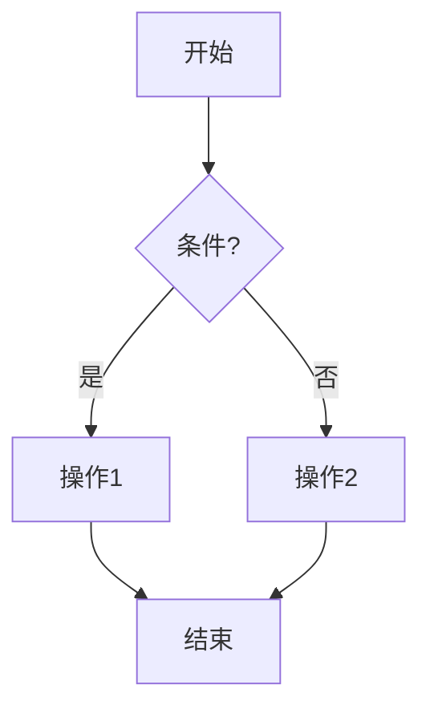
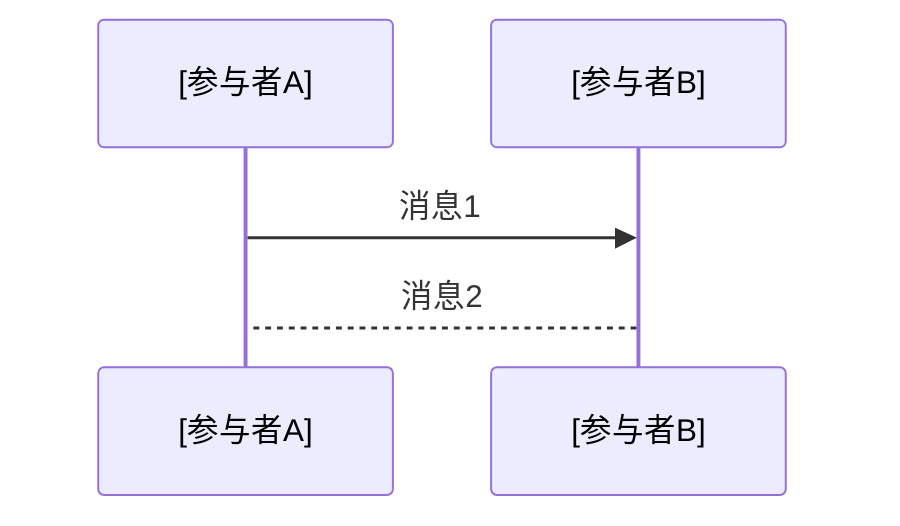
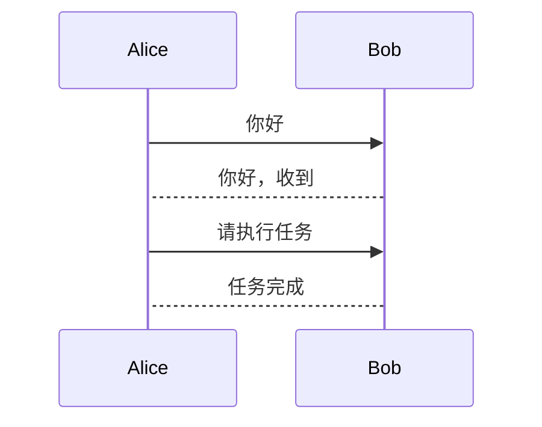
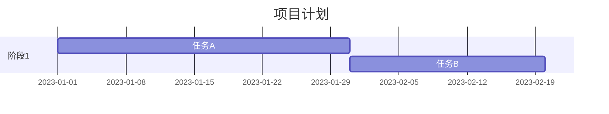
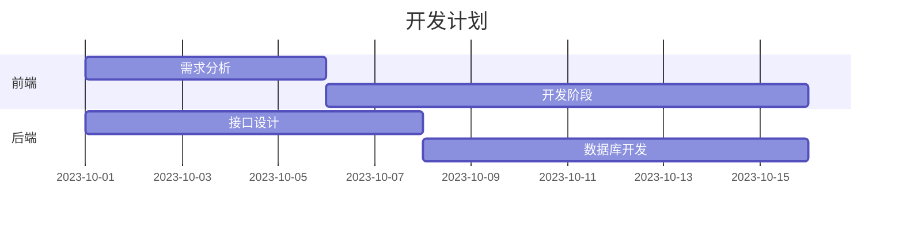
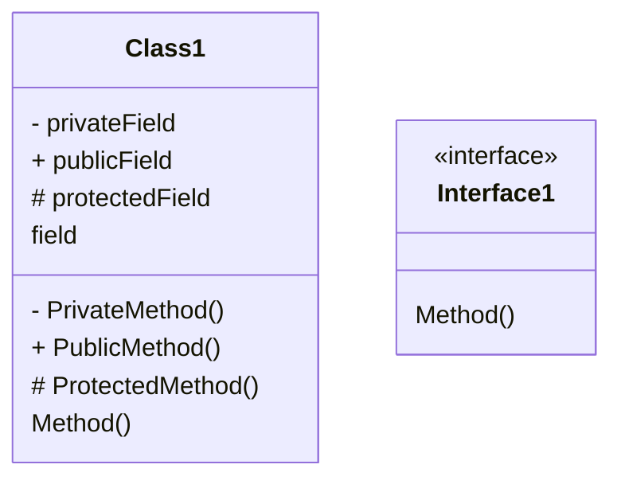
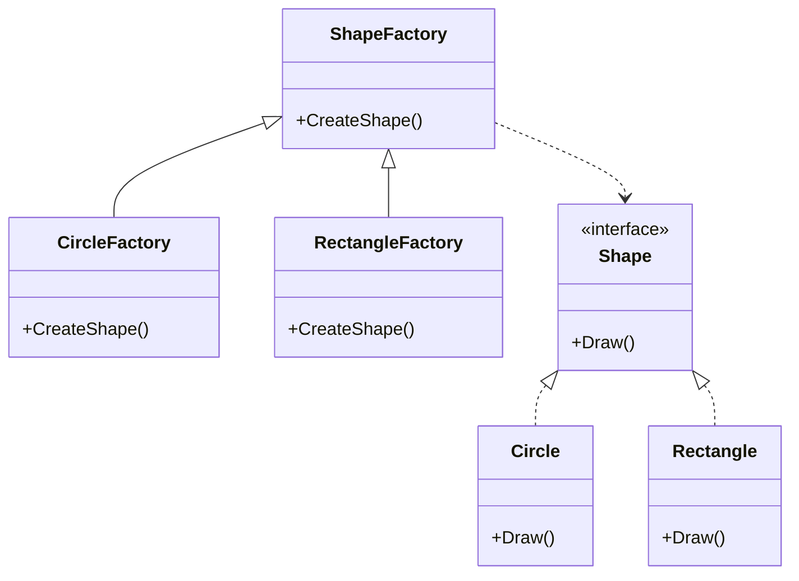
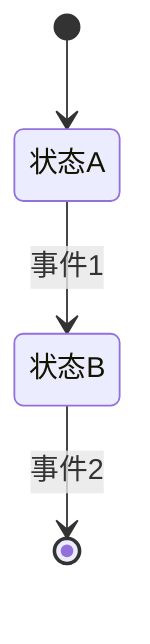
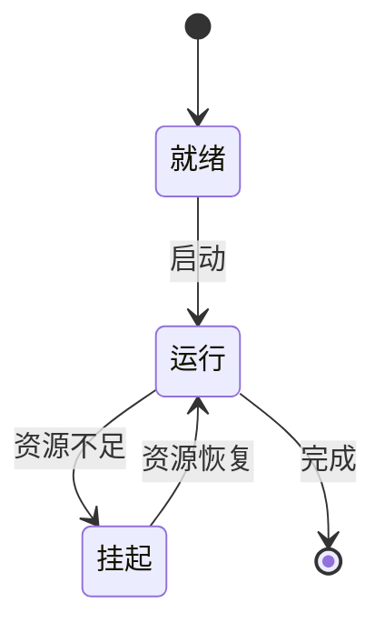

以下是 **Mermaid** 的官方文档链接、语法详解及示例，帮助你快速掌握其使用方法。

---

### **一、官方文档与学习资源**

1. **Mermaid 官方文档**（英文）
   [https://mermaid.js.org/syntax/](https://mermaid.js.org/syntax/)
   
   - 包含所有图表类型的语法说明和示例。
   - 提供交互式编辑器（[https://mermaid.live](https://mermaid.live)），可实时预览图表效果。
2. **中文社区文档**（翻译版）
   
   - [https://mermaid.js.org/zh/syntax/](https://mermaid.js.org/zh/syntax/)
   - 适合中文用户快速查阅。
3. **GitHub 项目地址**
   [https://github.com/mermaid-js/mermaid](https://github.com/mermaid-js/mermaid)
   
   - 查看源码、提交问题或参与开发。

---

### **二、Mermaid 语法详解与示例**

Mermaid 支持多种图表类型，以下是常见图表的语法和示例：

---

#### **1. 流程图（Flowchart）**

**语法结构**：

```markdown
```mermaid
graph [方向]
    [节点A] --> [节点B]
    [节点B] --> [节点C]
```

- **方向**：`TD`（Top → Down）、`LR`（Left → Right）、`RL`（Right → Left）、`BT`（Bottom → Top）。
- **节点**：用方括号 `[]` 包裹，支持文字、链接、样式。

**示例**：

```markdown


**效果**：


---

#### **2. 时序图（Sequence Diagram）**

**语法结构**：

```markdown


- **参与者**：用 `actor` 或直接命名。
- **消息**：`->>`（实线箭头）、`-->`（虚线箭头）、`-`（激活条）。

**示例**：

```markdown


**效果**：


---

#### **3. 甘特图（Gantt）**

**语法结构**：

```markdown


- **时间格式**：`YYYY-MM-DD` 或 `YYYY-MM-DD HH:MM`。
- **任务**：`任务名 :任务ID, 开始时间, 持续时间`。

**示例**：

```markdown


**效果**：


---

#### **4. 类图（Class Diagram）**


**语法结构**：

```markdown


**类间关系**：

| 关系 | 图                                              | mermaid       |
| ---- | ----------------------------------------------- | ------------- |
| 依赖 | Driver┉>Car                                     | `..>`, `..`   |
| 关联 | Customer─>Address，Teacher 1──n Student，自关联 | `-->`, `--`   |
| 聚合 | Car◇─>Engine                                    | `o--`, `o-->` |
| 组合 | Bird◆─>Wing                                     | `*--`, `*-->` |
| 实现 | Class┉▷Interface                                | `..|>`        |
| 继承 | Child━▷Parent                                   | `--|>`        |

**示例**：

```markdown


**效果**：


---

#### **5. 状态图（State Diagram）**


**语法结构**：

```markdown


- **状态**：用 `state` 定义。
- **转换**：`状态A --> 状态B : 事件`。

**示例**：

```markdown


**效果**：  


---

### **三、Mermaid 的 Markdown 兼容性**

1. **支持的编辑器**：
   - **Typora**：直接支持 Mermaid 语法（无需插件）。
   - **VS Code**：需安装插件（如 `Mermaid Diagram`）。
   - **Obsidian**：默认支持 Mermaid。
   - **Jupyter Notebook**：通过 `mermaid` 库渲染。

2. **代码块格式**：
   ```markdown
   ```mermaid
   [图表类型]
   [图表内容]
   ```

- 例如：`graph TD` 表示流程图，`sequenceDiagram` 表示时序图。

---

### **四、常见问题与技巧**

1. **图表未渲染**：
   
   - 检查编辑器是否支持 Mermaid（如 Typora 需启用 `偏好设置 → Markdown → Mermaid`）。
   - 确保代码块标记为 `mermaid`（如 ```mermaid）。
2. **样式自定义**：
   
   - 使用 `style` 指定节点样式：
     ```mermaid
     graph TD
         A --> B
         style A fill:#f9f,stroke:#333
     ```
3. **复杂图表**：
   
   - 使用子图表（`subgraph`）分组节点：
     ```mermaid
     graph TD
         subgraph 模块A
             A1 --> A2
         end
         subgraph 模块B
             B1 --> B2
         end
     ```

---

### **五、总结**

Mermaid 以 **简单语法** 和 **无缝 Markdown 集成** 见长，适合快速绘制流程图、时序图等基础图表。对于复杂 UML 需求（如组件图、部署图），建议使用 PlantUML。根据你的需求选择合适的工具即可！
