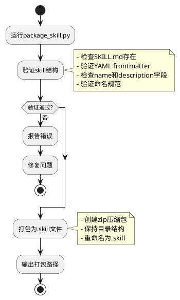
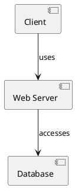
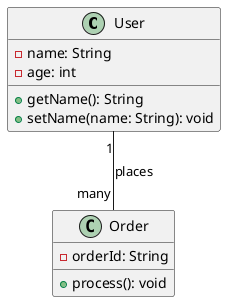
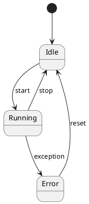
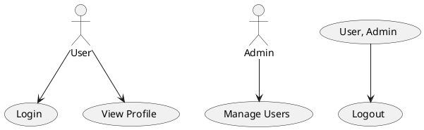
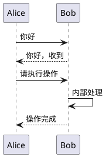
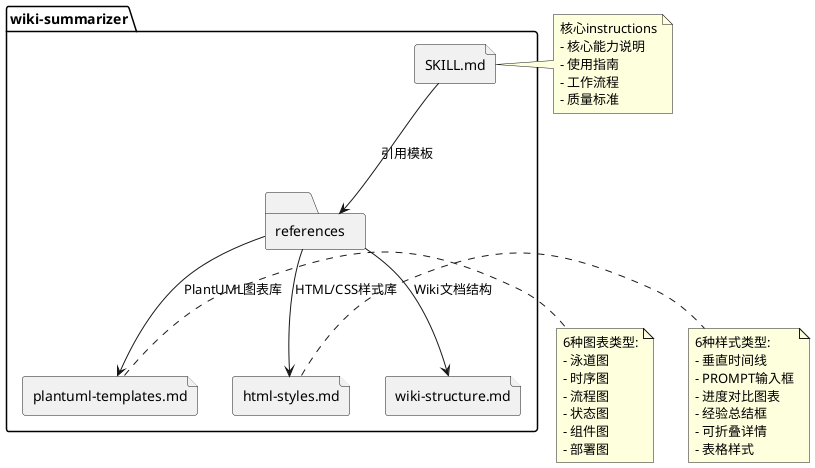
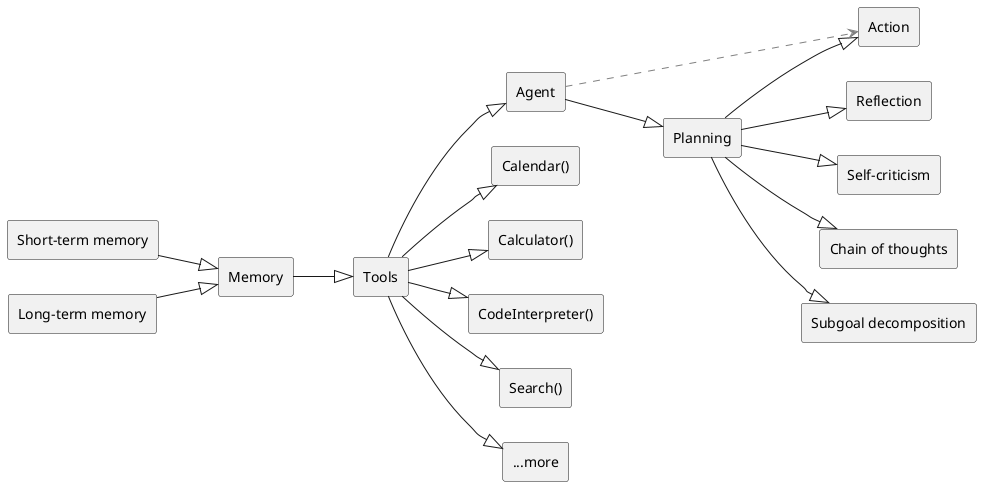
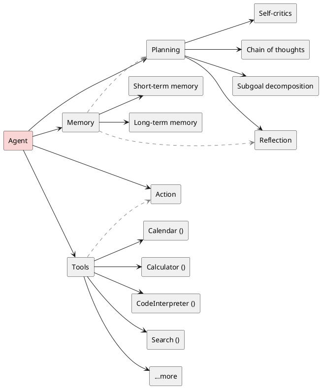
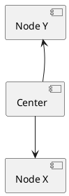

# 流程图



# 组件图




# 类图



* ​**符号说明**​：
  * `-`：私有属性/方法
  * `+`：公有属性/方法
  * `--`：关联关系
  * `: places`：关联标签
  * `"1" -- "many"`：多重性（可选）

# 状态图



# 用例图



* ​**符号说明**​：
  * `actor`：参与者
  * `-->`：关联关系
  * `()`：用例（功能）

# 时序图



* ​**符号说明**​：
  * `->`：同步消息
  * `-->`：返回消息
  * `->>`：创建对象（`new`）
  * `-->>`：销毁对象

# 高级语法

## ​注释

```plantuml
' 单行注释
package "wiki-summarizer" {
  file "SKILL.md" as skill_md
  folder "references" as refs
}

```

## 颜色与样式

```plantuml
skinparam defaultTextAlignment center
skinparam shadowing true

'定义note样式
skinparam note {
    BackgroundColor #yellow
    BorderColor #black
    BorderThickness 1
}

class User #LightBlue
class Order #FFBBBB
User --> Order : [color: red]

note right of User
colourful
end note
```

## 继承与接口

```plantuml
interface Payment {
  + pay(amount: double): void
}

class CreditCardPayment
CreditCardPayment <|-- Payment
```

## 组合/聚合

```plantuml
class Car {
  - engine: Engine
}
class Engine

Car *-- Engine : contains
```

# test1



# test2



# test3



# test4


